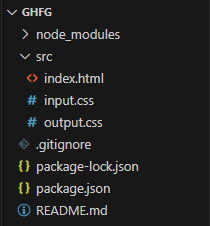

# Гайд как загрузить tailwindcss

## 1. Создание папки вашего дз
Создаём папку с названием вашего дз
и открываем её в Visual Studio Code


## 2. Установка tailwindcss
В VSCode пишем в терминале:

```bash
npm install tailwindcss @tailwindcss/cli
```
## 3. Создание структуры дз

### 3.1 Создание файлика .gitignore
Создаём в корневой папке проекта файлик `.gitignore`, и втавляем внутри него такой текст:

```
./node_modules
.package-lock.json
```
### 3.2 Создание основной структуры дз
Создаём папку src в корневой папке проекта и внутри неё создаём файлики:
- index.html
- input.css
- output.css

## 4. Подключение tailwindcss
Открываем консоль и пишем следующую команду, чтобы запустить tailwindcss:
```bash
npx @tailwindcss/cli -i ./src/input.css -o ./src/output.css --watch
```

## 5. Подключение tailwindcss в html
В файле index.html, в теге head, добавляем следующий код, для работоспособности tailwindcss:
```html
<link href="./output.css" rel="stylesheet">
```

## 6. Начало выполнение дз
После прохождения всех пунктов, можно приступать к выполнению дз.
Напоминаю, что при выполнении дз ОБЯЗАТЕЛЬНО использование этих инструментов:
- гриды / grids
- css счётчиков*
- tailwindcss

## 7. Итоговая структура проекта


> \* Про счётчики вы можете найти тут - https://doka.guide/css/css-counters/ Но так же вы можете использовать любые другие документации про css-counters